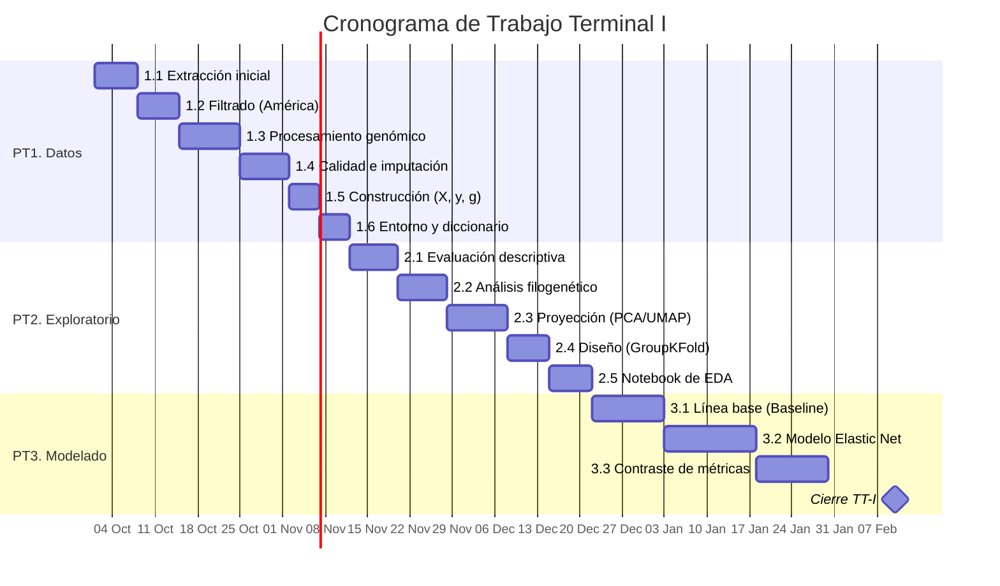

# proyecto-tt-snp

```mermaid
gantt
    title Cronograma de Trabajo Terminal I
    dateFormat  YYYY-MM-DD
    axisFormat  %d %b
    tickInterval 1week

    section PT1. Datos
    1.1 Extracción inicial        :a1, 2026-10-01, 7d
    1.2 Filtrado (América)        :a2, after a1, 7d
    1.3 Procesamiento genómico    :a3, after a2, 10d
    1.4 Calidad e imputación      :a4, after a3, 8d
    1.5 Construcción (X, y, g)    :a5, after a4, 5d
    1.6 Entorno y diccionario     :a6, after a5, 5d

    section PT2. Exploratorio
    2.1 Evaluación descriptiva    :b1, after a6, 8d
    2.2 Análisis filogenético     :b2, after b1, 8d
    2.3 Proyección (PCA/UMAP)     :b3, after b2, 10d
    2.4 Diseño (GroupKFold)       :b4, after b3, 7d
    2.5 Notebook de EDA           :b5, after b4, 7d

    section PT3. Modelado
    3.1 Línea base (Baseline)     :c1, after b5, 12d
    3.2 Modelo Elastic Net        :c2, after c1, 15d
    3.3 Contraste de métricas     :c3, after c2, 12d
    Cierre TT-I                   :milestone, 2027-02-10, 0d
```
